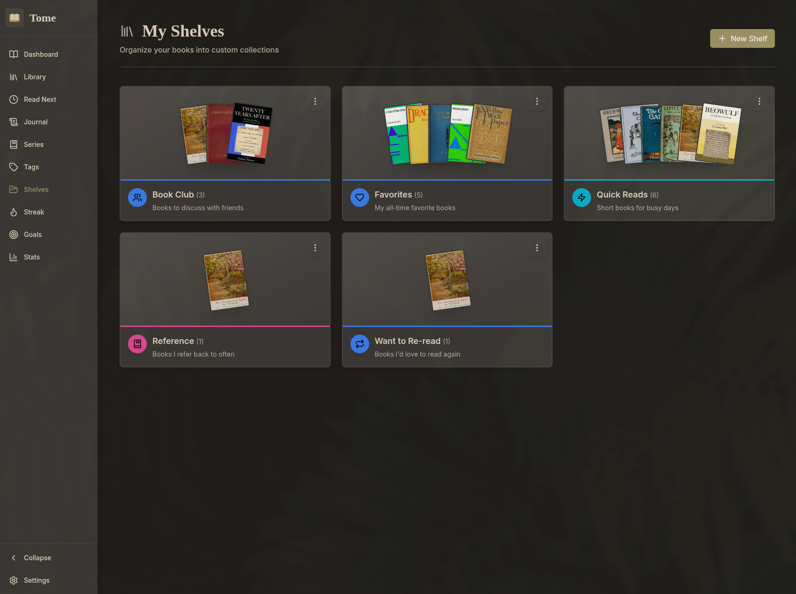
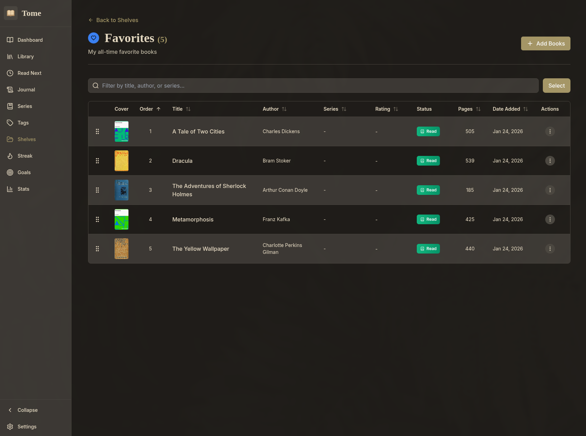
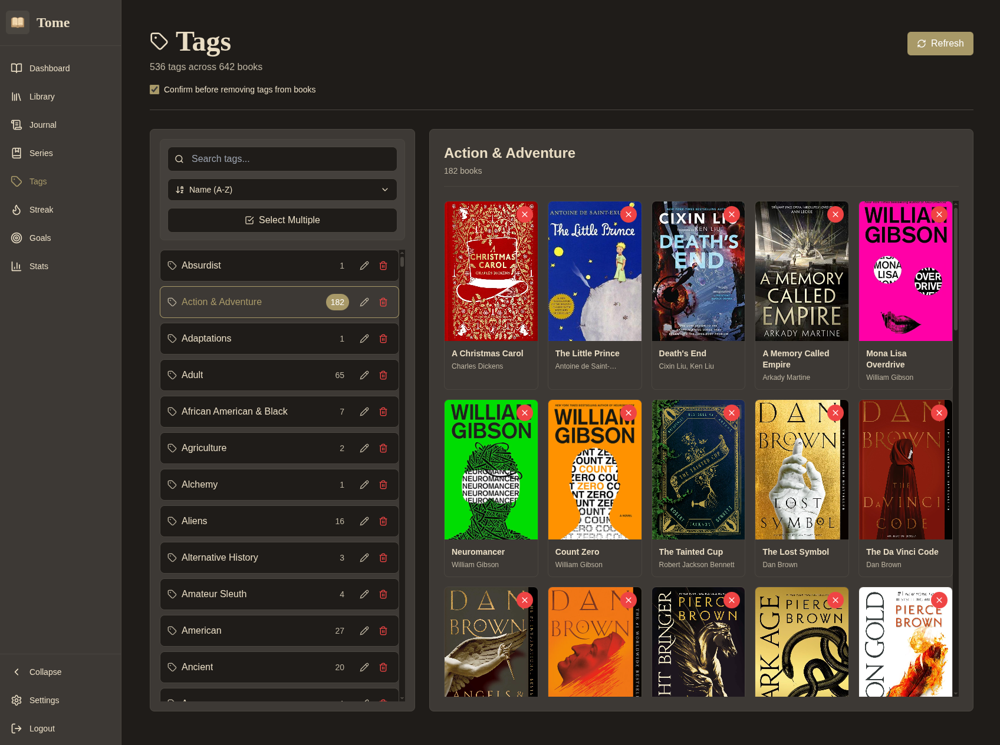

<div align="center">

# 📚 Tome

**Tome** is a self-hosted book tracking web application that integrates directly with Calibre's database to provide reading progress tracking, status management, and streak functionality.

[🚀 Get Started](#get-started) • [🎮 Try Demo](https://demo.tomeapp.dev) • [💬 Community](https://github.com/masonfox/tome/discussions)

<p align="center">
  
</p>

<details> <summary>Additional Screenshots</summary>

**Library**


**Book Detail**


**Shelves**


**Shelf**


**Series**


**Journal**


**Streak**


**Goals**


**Tag Manager**


</details>

<br>

[](https://github.com/masonfox/tome/releases) [](LICENSE) [](https://github.com/masonfox/tome/stargazers) [](https://codecov.io/gh/masonfox/tome) [](https://github.com/sponsors/masonfox)

[](https://www.buymeacoffee.com/masonfox)

---

</div>

## What is Tome?

Tome is a local-first book tracking application that gives you durable ownership of your reading history. It seamlessly integrates with your existing Calibre library to track reading progress, sessions, and streaks—without disrupting your workflow or requiring cloud services.

Your reading data lives locally, under your control, and survives platform changes forever.

## Features

- 🔗 **Calibre Integration**: Integrates directly with Calibre, automatically syncing your library
- 📖 **Reading Progress Tracking**: Track page-based or percentage-based progress with history
- 📈 **Enhanced Reading Streaks**: Daily streak tracking with configurable goals and analytics
- ▶️ **Book Status Management**: Organize books by reading status (To Read, Read Next, Reading, Read, and DNF). Supports rereads while preserving previous reading sessions.
- 🏷️ **Robust [Tag Management](https://github.com/masonfox/tome/discussions/225)**: Easily remove a tag from many books in a single click, merge multiple tags into one, and bulk delete tags.
- 📊 **Statistics Dashboard**: Comprehensive reading statistics
- 🥇 **Annual goals**: Set and track annual reading goals
- 🌐 **OPDS Catalog** - [OPDS](https://opds.io/) support to download books on the go with Tome enhancements. See [setup](./docs/OPDS.md) documentation.
- 🪛 **Self-Hosted**: Full control over your data with no external dependencies

## Get Started

### Production Deployment

For detailed production deployment instructions, see [the deployment guide](./docs/DEPLOYMENT.md).

### Local Development

```bash
# Install dependencies
bun install

# Configure environment
cp .env.example .env
# Edit .env and set CALIBRE_DB_PATH to your Calibre library

# Run database migrations
npm run db:migrate

# (Optionally) run DB seeder
npm run db:seed

# Start development server
bun run dev
```

Visit [http://localhost:3000](http://localhost:3000) and sync your Calibre library from the Library page.

## ⚠️ Calibre Safety

Tome reads from and writes to Calibre's `metadata.db`. **Concurrent writes** (for example, editing tags or ratings in Tome while Calibre is running) can lead to database locks or unpredictable results. **Read-only access is safe!**

## Roadmap
Active development can be viewed [here](https://github.com/users/masonfox/projects/2/views/6), representing the upcoming release. Additionally, checkout repo [discussions](https://github.com/masonfox/tome/discussions) for [release](https://github.com/masonfox/tome/discussions?discussions_q=is%3Aopen+label%3ARelease) and [feature](https://github.com/masonfox/tome/discussions?discussions_q=is%3Aopen+label%3Afeature) announcements and more!

You're **highly encouraged** to create [issues](https://github.com/masonfox/tome/issues) and create [discussions](https://github.com/masonfox/tome/discussions)! 🙏

## Documentation

Comprehensive documentation is available in the [`/docs`](./docs) directory:

- **[Documentation Index](./docs/README.md)** - Complete guide to all documentation
- **[Deployment Guide](./docs/DEPLOYMENT.md)** - Docker deployment, migrations, and production setup
- **[Database Management](./docs/DATABASE.md)** - Schema management, backups, and maintenance
- **[Troubleshooting](./docs/TROUBLESHOOTING.md)** - Common issues and solutions
- **[Architecture](./docs/ARCHITECTURE.md)** - System architecture and patterns
- **[Testing Guide](./__tests__/README.md)** - Testing patterns and best practices


## Contributing

Contributions are welcome! Before contributing, please:

1. Read the [Architecture Documentation](./docs/ARCHITECTURE.md) to understand the system design
2. Review the [Constitution](./.specify/memory/constitution.md) for project principles
3. Check the [Testing Guide](./__tests__/README.md) for testing best practices
4. Ensure all tests pass: `npm test`

## License

MIT

## Acknowledgments

Built with a focus on local-first architecture, durable data ownership, and seamless Calibre integration.
